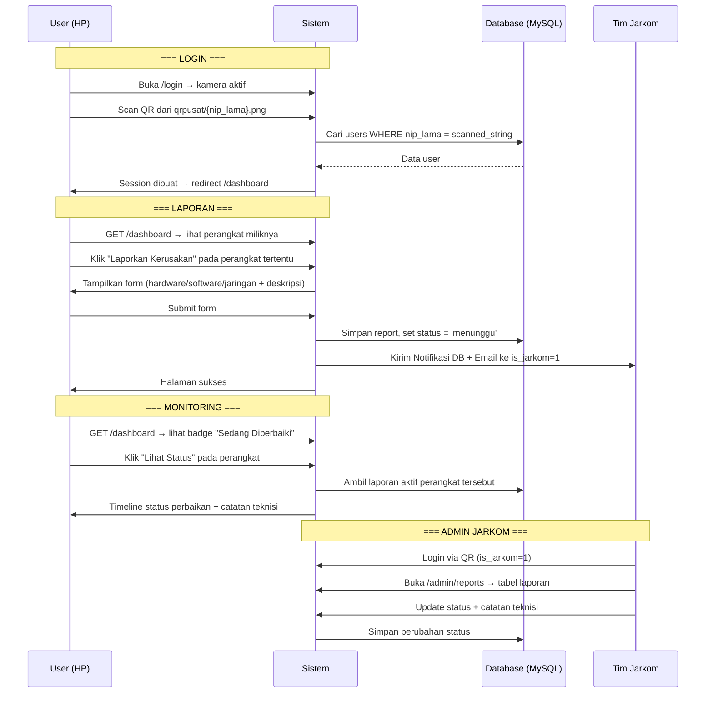

# Web Pelaporan Perangkat TI Rusak — Updated Plan

Sistem pelaporan kerusakan perangkat IT berbasis QR Code menggunakan **Laravel 13 + MySQL (Laragon)**. Login menggunakan scan QR pegawai, daftar perangkat ditampilkan berdasarkan pemilik (user), laporan diisi langsung tanpa scan perangkat.

---

## Pemahaman Data dari Excel & File yang Ada

### Tabel `users` (dari `user.xlsx`)
| Kolom | Contoh | Keterangan |
|---|---|---|
| `nip_lama` | `340014249` | ID unik lama — nama file di `public/qrpusat/` |
| `nama` | `Aidil Adha, S.E., M.E.` | Nama lengkap |
| `nip_baru` | `196703221994011001` | NIP baru — nama file di `public/qrjambi/` |
| `fungsi` | `1` (Kepala), `2` (Kabag), `3`-`9` | Bidang/fungsi |
| `jabatan` | `Kepala`, `Kepala Bagian Umum` | Jabatan |

**Catatan penting:**
- User dengan `nip_lama` kecil (1–16, 99) adalah **ruangan/gudang** bukan orang, sebagai pemilik perangkat non-personal.
- `public/qrpusat/*.png` → nama file = `nip_lama` (mis. `340014249.png`)
- `public/qrjambi/*.png` → nama file = `nip_baru` (mis. `196703221994011001.png`)
- Login: scan QR pusat → dapat `nip_lama` → cocokkan ke tabel `users`

### Tabel `devices` (dari `device.xlsx`, 511 baris)
| Kolom | Contoh | Keterangan |
|---|---|---|
| `id` | `3100102001-54` | ID unik perangkat (kode BMN) |
| `id_type` | `1` (PC), `2` (Laptop), dst | FK ke `types` |
| `year` | `2008` | Tahun pengadaan |
| `id_source` | `1` (Pusat), `2` (Provinsi) | FK ke `sources` |
| `brand` | `DELL`, `HP`, dll | Merek |
| `series` | `DELL / OptiPlex 330 Tipe A` | Seri/tipe |
| `serial_number` | `-` | Nomor seri |
| `id_status_bmn` | `1` (Aktif), `2` (Tidak Aktif) | FK ke `status_bmn` |
| `id_condition` | `1` (Baik), `2` (Rusak Ringan), `3` (Rusak Berat) | FK ke `conditions` |
| `keterangan` | `-` | Keterangan bebas |
| `id_user` | `nip_lama` pengguna (misal `340014249` atau `15` utk Gudang) | FK ke `users.nip_lama` |

### Tabel Referensi
| Tabel | Data |
|---|---|
| `types` | PC, Laptop, Printer, UPS, Scanner, Viewer, Tablet, Tidak Diketahui |
| `conditions` | Baik, Rusak Ringan, Rusak Berat, Tidak Diketahui |
| `sources` | Pusat, Provinsi, Tidak Diketahui |
| `status_bmn` | Aktif, Tidak Aktif, Tidak Diketahui |
| `vendor_services` | Bumi Komputer, Eleven Komputer |

---

## Open Questions

> [!IMPORTANT]
> **QR Content**: File QR di `qrpusat` namanya = `nip_lama`. Apakah isi QR code juga meng-encode string `nip_lama`, atau ada URL/string lain? Plan ini mengasumsikan QR meng-encode **string `nip_lama`** saja (mis. `340014249`).

> [!IMPORTANT]
> **`is_jarkom`**: Apakah perlu kolom baru `is_jarkom` di tabel users, atau bisa ditentukan dari kolom `fungsi` yang sudah ada? (mis. fungsi tertentu = tim jarkom). Jika kolom baru: siapa yang perlu di-set `is_jarkom=1`?

> [!WARNING]
> **`fungsi` kolom**: Nilai fungsi 1–9 ada di Excel tapi tidak ada file `fungsi.xlsx`. Apakah ada mapping nama fungsi, atau cukup sebagai angka saja?

---

## Proposed Changes

### 1. Konfigurasi Database

---

#### [MODIFY] [.env](file:///d:/code/mlti/.env)

Ubah dari SQLite ke MySQL Laragon:

```diff
-DB_CONNECTION=sqlite
-# DB_HOST=127.0.0.1
-# DB_PORT=3306
-# DB_DATABASE=laravel
-# DB_USERNAME=root
-# DB_PASSWORD=
+DB_CONNECTION=mysql
+DB_HOST=127.0.0.1
+DB_PORT=3306
+DB_DATABASE=mlti
+DB_USERNAME=root
+DB_PASSWORD=
```

---

### 2. Database Migrations

---

#### [MODIFY] `0001_01_01_000000_create_users_table.php`

Ganti schema user default Laravel dengan schema dari `user.xlsx`:

```php
Schema::create('users', function (Blueprint $table) {
    $table->bigInteger('nip_lama')->primary();  // PK = nip_lama dari QR
    $table->string('nama');
    $table->string('nip_baru', 30)->nullable()->unique();
    $table->unsignedTinyInteger('fungsi')->default(99);
    $table->string('jabatan')->nullable();
    $table->string('password')->nullable();   // null = login via QR only
    $table->tinyInteger('is_jarkom')->default(0);
    $table->rememberToken();
    $table->timestamps();
});
```

> **Catatan**: `nip_lama` menjadi Primary Key. Password nullable karena login hanya via QR scan.

---

#### [NEW] `..._create_reference_tables_migration.php`

Buat 4 tabel referensi sekaligus:

- `types` → id, jenis
- `conditions` → id, kondisi
- `sources` → id, asal
- `status_bmn` → id, status
- `vendor_services` → id, vendor_service

---

#### [NEW] `..._create_devices_table.php`

```php
Schema::create('devices', function (Blueprint $table) {
    $table->string('id')->primary();           // '3100102001-54'
    $table->unsignedBigInteger('id_type');
    $table->year('year')->nullable();
    $table->unsignedBigInteger('id_source');
    $table->string('brand')->nullable();
    $table->string('series')->nullable();
    $table->string('serial_number')->nullable();
    $table->unsignedBigInteger('id_status_bmn');
    $table->unsignedBigInteger('id_condition');
    $table->text('keterangan')->nullable();
    $table->bigInteger('id_user')->nullable();  // FK ke users.nip_lama
    $table->foreign('id_user')->references('nip_lama')->on('users');
    $table->timestamps();
});
```

---

#### [NEW] `..._create_reports_table.php`

```php
Schema::create('reports', function (Blueprint $table) {
    $table->id();
    $table->string('device_id');              // FK ke devices.id
    $table->bigInteger('reported_by');        // FK ke users.nip_lama (pelapor)
    $table->enum('issue_type', ['hardware', 'software', 'jaringan']);
    $table->text('description');
    $table->enum('status', ['menunggu', 'diproses', 'selesai', 'ditolak'])
          ->default('menunggu');
    $table->text('technician_notes')->nullable();
    $table->bigInteger('handled_by')->nullable(); // FK ke users.nip_lama (teknisi)
    $table->unsignedBigInteger('id_vendor')->nullable(); // FK ke vendor_services
    $table->timestamp('resolved_at')->nullable();
    $table->timestamps();
    $table->foreign('device_id')->references('id')->on('devices');
    $table->foreign('reported_by')->references('nip_lama')->on('users');
    $table->foreign('handled_by')->references('nip_lama')->on('users');
});
```

---

#### Tabel Notifikasi

Gunakan perintah bawaan Laravel:
```bash
php artisan notifications:table
php artisan migrate
```

---

### 3. Models

---

#### [MODIFY] [User.php](file:///d:/code/mlti/app/Models/User.php)

- Ganti PK dari `id` ke `nip_lama`
- Tambah fillable: `nip_lama`, `nama`, `nip_baru`, `fungsi`, `jabatan`, `is_jarkom`
- Relasi: `hasMany(Device::class, 'id_user', 'nip_lama')`
- Relasi: `hasMany(Report::class, 'reported_by', 'nip_lama')`
- Method helper: `isJarkom()` → return `$this->is_jarkom == 1`

#### [NEW] `app/Models/Device.php`

- PK string `id`
- `belongsTo(User::class, 'id_user', 'nip_lama')`
- `belongsTo(Type::class, 'id_type')`
- `belongsTo(Condition::class, 'id_condition')`
- `hasMany(Report::class, 'device_id', 'id')`
- Method `activeReport()` → laporan terakhir yang belum selesai

#### [NEW] `app/Models/Report.php`

- `belongsTo(Device::class, 'device_id', 'id')`
- `belongsTo(User::class, 'reported_by', 'nip_lama')`
- `belongsTo(User::class, 'handled_by', 'nip_lama')`

#### [NEW] Model referensi: `Type.php`, `Condition.php`, `Source.php`, `StatusBmn.php`, `VendorService.php`

---

### 4. Seeders (dari Excel)

---

Gunakan package **`maatwebsite/excel`** untuk import data langsung dari file xlsx.

#### [MODIFY] `DatabaseSeeder.php`

Urutan seeding:
1. `TypeSeeder` → dari `type.xlsx`
2. `ConditionSeeder` → dari `condition.xlsx`
3. `SourceSeeder` → dari `source.xlsx`
4. `StatusBmnSeeder` → dari `status_bmn.xlsx`
5. `VendorServiceSeeder` → dari `vendor_service.xlsx`
6. `UserSeeder` → dari `user.xlsx` (**set `is_jarkom=1` untuk fungsi tertentu**)
7. `DeviceSeeder` → dari `device.xlsx`

#### [NEW] `app/Imports/` — 7 Import classes untuk masing-masing Excel

---

### 5. Alur Login via QR Scan

---

#### [NEW] `app/Http/Controllers/Auth/QrLoginController.php`

```
GET  /login          → Tampilkan halaman kamera scan QR
POST /login/verify   → Terima { qr_string }, cocokkan ke users.nip_lama, buat session
POST /logout         → Hapus session
```

**Logika:**
1. User buka `/login` → browser aktifkan kamera lewat `html5-qrcode` JS
2. Scan QR dari kartu `public/qrpusat/{nip_lama}.png`
3. QR decode → dapat string `nip_lama` (misal `340014249`)
4. POST ke `/login/verify` dengan `{ qr_string: "340014249" }`
5. Cari `User::where('nip_lama', $qr_string)->firstOrFail()`
6. Login dengan `Auth::login($user)`
7. Redirect ke `/dashboard`

---

### 6. Alur Utama — Dashboard & Pelaporan

---

#### [NEW] `app/Http/Controllers/DashboardController.php`

```
GET /dashboard   → Tampilkan perangkat milik user yang login
```

Menampilkan semua perangkat `devices` di mana `id_user = auth()->user()->nip_lama`, dikelompokkan per jenis (PC, Laptop, Printer, dll).

Setiap perangkat memiliki tombol **"Laporkan Kerusakan"** atau badge **"Sedang Diperbaiki"** jika ada laporan aktif.

---

#### [NEW] `app/Http/Controllers/ReportController.php`

| Method | Route | Fungsi |
|---|---|---|
| `create` | `GET /report/create/{device_id}` | Form laporan kerusakan |
| `store` | `POST /report` | Simpan laporan + kirim notifikasi jarkom |
| `status` | `GET /report/status/{device_id}` | Timeline status perbaikan |

---

#### [NEW] `app/Http/Controllers/Admin/ReportController.php`

| Method | Route | Fungsi |
|---|---|---|
| `index` | `GET /admin/reports` | Tabel semua laporan + filter |
| `show` | `GET /admin/reports/{id}` | Detail laporan |
| `update` | `PATCH /admin/reports/{id}` | Update status + catatan teknisi |

---

### 7. Notifikasi Tim Jarkom

---

#### [NEW] `app/Notifications/NewDeviceReport.php`

Dikirim ke semua `User::where('is_jarkom', 1)->get()` via:
- **`database`** channel → badge notifikasi di admin panel
- **`mail`** channel → email HTML detail laporan (nama perangkat, jenis, deskripsi, pelapor)

---

### 8. Routes

---

#### [MODIFY] [web.php](file:///d:/code/mlti/routes/web.php)

```php
// Auth via QR
Route::get('/login', [QrLoginController::class, 'showForm'])->name('login');
Route::post('/login/verify', [QrLoginController::class, 'verify'])->name('login.verify');
Route::post('/logout', [QrLoginController::class, 'logout'])->name('logout');

// User - butuh login
Route::middleware('auth')->group(function () {
    Route::get('/dashboard', [DashboardController::class, 'index'])->name('dashboard');
    Route::get('/report/create/{device_id}', [ReportController::class, 'create']);
    Route::post('/report', [ReportController::class, 'store'])->name('report.store');
    Route::get('/report/status/{device_id}', [ReportController::class, 'status']);
});

// Admin/Jarkom
Route::middleware(['auth', 'jarkom'])->prefix('admin')->group(function () {
    Route::get('/reports', [Admin\ReportController::class, 'index']);
    Route::get('/reports/{id}', [Admin\ReportController::class, 'show']);
    Route::patch('/reports/{id}', [Admin\ReportController::class, 'update']);
    Route::get('/notifications', [NotificationController::class, 'index']);
    Route::post('/notifications/{id}/read', [NotificationController::class, 'markRead']);
});
```

---

### 9. Middleware

---

#### [NEW] `app/Http/Middleware/JarkomMiddleware.php`

Cek `auth()->user()->is_jarkom == 1`, jika tidak redirect ke `/dashboard` dengan pesan error.

---

### 10. Views (Blade)

---

#### Halaman Publik

| File | Fungsi |
|---|---|
| `[NEW] views/auth/login.blade.php` | Kamera scan QR login, pakai `html5-qrcode` JS |
| `[NEW] views/dashboard.blade.php` | Grid perangkat milik user (kartu per perangkat) |
| `[NEW] views/report/create.blade.php` | Form: pilih jenis kendala + deskripsi |
| `[NEW] views/report/success.blade.php` | Konfirmasi laporan terkirim |
| `[NEW] views/report/status.blade.php` | Timeline status perbaikan |

#### Halaman Admin/Jarkom

| File | Fungsi |
|---|---|
| `[NEW] views/layouts/admin.blade.php` | Layout sidebar + notifikasi badge |
| `[NEW] views/admin/reports/index.blade.php` | Tabel laporan + filter status/jenis |
| `[NEW] views/admin/reports/show.blade.php` | Detail laporan + form update status |
| `[NEW] views/admin/notifications/index.blade.php` | List notifikasi in-app |

#### Email Template

| File | Fungsi |
|---|---|
| `[NEW] views/emails/new-report.blade.php` | Email HTML ke Tim Jarkom |

---

### 11. Packages Tambahan

---

| Package | Tujuan | Perintah |
|---|---|---|
| `maatwebsite/excel` | Import data dari file `.xlsx` | `composer require maatwebsite/excel` |

> **html5-qrcode** → library JS via CDN, tidak perlu npm install tambahan.

---

## Alur Kerja Lengkap



---

## Verification Plan

### Setup & Migrate
```bash
composer require maatwebsite/excel
php artisan migrate:fresh --seed
php artisan storage:link
php artisan serve
```

### Manual Verification
1. Buka `/login` → scan salah satu QR dari `public/qrpusat/` → verifikasi session user terbentuk
2. Cek `/dashboard` → pastikan perangkat milik user tampil dengan benar
3. Klik "Laporkan Kerusakan" → isi form → submit → cek tabel `reports`
4. Login sebagai user `is_jarkom=1` → cek badge notifikasi
5. Buka `/admin/reports` → update status → cek perubahan di dashboard user
6. Cek email log (`storage/logs/laravel.log`) untuk konfirmasi notifikasi email terkirim
